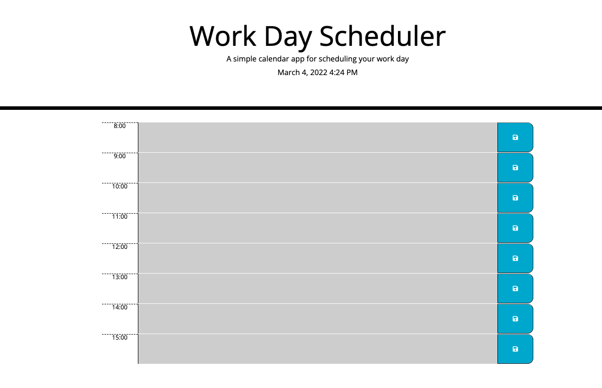

# daily-planner

## Link to Deployed Page

https://davidayl.github.io/daily-planner/

## Table of Contents

1. [About](#about)

## About

    This Project uses javascript, css and html to create a daily planner that stores your information and color codes the time for you. The main portion of this project was designed and created in Javascript but it still includes elements from other languages as well. The page also stores what you have typed in it beforehand so it does not get removed upon refresh.

## Important Code

This code has a couple of moving parts but the main one I am going to show is the loop that creates all the elements on the page. It does this by creating elements and then appending them, this loop also gives these elements classes.

        for (var i = 8; i <= 15; i++) {
        var row = document.createElement("div");
        row.classList.add("row", "time-block");
        row.dataset.hour = i;
        var hour = document.createElement("div");
        hour.classList.add("col-1", "hour");
        hour.textContent = i + ":00";
        var description = document.createElement("textarea");
        if (moment().hour() == i) {
            description.classList.add("present");
        } else if (moment().hour() >= i) {
            description.classList.add("past");
        } else {
            description.classList.add("future");
        }
        description.classList.add("col-10", "description");
        description.value = JSON.parse(localStorage.getItem(i));
        var saveBtn = document.createElement("button");
        saveBtn.classList.add("col-1", "saveBtn", "fas", "fa-save");
        row.appendChild(hour);
        row.appendChild(description);
        row.appendChild(saveBtn);
        containerEl.appendChild(row);
        } 

## Visuals

 Here is an image of the completed page.

 

 ## Reference Links

 https://www.w3schools.com/js/js_loop_for.asp
 
 ### For Loops

 https://developer.mozilla.org/en-US/docs/Web/API/Window/localStorage

 ### Local Storage
